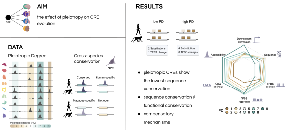

<!-- README.md is generated from README.Rmd. Please edit that file -->

```{r, echo = FALSE}
knitr::opts_chunk$set(
  collapse = TRUE,
  comment = "#>",
  fig.path = "README-"
)
```

# The effect of pleiotropy on regulatory element evolution

[](https://zenodo.org/badge/latestdoi/332821121)
wrong DOI\
This repository contains the code to reproduce the analysis for the manuscript 

**Evidence for compensatory evolution within pleiotropic regulatory elements** 

by Zane Kliesmete, Peter Orchard, Victor Yan Kin Lee, Johanna Geuder, Simon M. Krauß, Mari Ohnuki, Jessica Jocher, Beate Vieth, Wolfgang Enard, Ines Hellmann 


# 

The data necessary to reproduce this analysis can be found on ArrayExpress:

| Accession    | Dataset                                         |
|--------------|-------------------------------------------------|
| E-MTAB-13494 | RNA-seq data from human and cynomolgus macaque  |
| E-MTAB-13373 | ATAC-seq data from human and cynomolgus macaque |


### 1. Re-analyzing the DNase-seq and RNA-seq data from Roadmap Epigenomics Project
In the beginning of the study, we use published data to quantify the **Pleiotropic Degree (PD)** for nearly 0.5 million CREs accessible in at least one of the following nine human fetal tissues: adrenal gland, brain, heart, kidney, large intestine, lung, muscle, stomach and thymus. We furthermore associate these CREs to expressed genes in the respective tissue and model the importance of different CRE properties on gene expression levels. The relevant analysis scripts for this part, underlying **Figure 1** and **Supplemental Figures 1,2** are the following:\

[DHS peak analyses](scripts/1.1_basics.Rmd)\
[Expression data preparation](scripts/1.2_tissueExpression.Rmd)\
[CRE to gene association](scripts/1.3_reg2gene.Rmd)\
[Mixed model fitting and permutations](scripts/1.4_run_model_permutations_expression_pleiotropy.R)\
[Generate Figure 1](scripts/1.5_figure1.R)\

### 2. Cross-species accessibility and expression analyses
