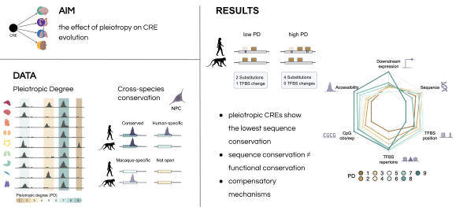

<!-- README.md is generated from README.Rmd. Please edit that file -->

# Evidence for compensatory evolution within pleiotropic regulatory elements

This repository contains the code to reproduce the analysis for the
manuscript

### **Evidence for compensatory evolution within pleiotropic regulatory elements**

by Zane Kliesmete, Peter Orchard, Victor Yan Kin Lee, Johanna Geuder,
Simon M. Krauß, Mari Ohnuki, Jessica Jocher, Beate Vieth, Wolfgang
Enard, Ines Hellmann

# 

The data necessary to reproduce this analysis can be found on
ArrayExpress:

| Accession    | Dataset                                         |
|--------------|-------------------------------------------------|
| E-MTAB-13494 | RNA-seq data from human and cynomolgus macaque  |
| E-MTAB-13373 | ATAC-seq data from human and cynomolgus macaque |

### 1. Re-analyzing the DNase-seq and RNA-seq data from Roadmap Epigenomics Project

As a part of the study, we use published data to quantify the
**Pleiotropic Degree (PD)** for nearly 0.5 million CREs accessible in at
least one of the following nine human fetal tissues: adrenal gland,
brain, heart, kidney, large intestine, lung, muscle, stomach and thymus.
We furthermore associate these CREs to expressed genes in the respective
tissue and model the importance of different CRE properties on gene
expression levels using a mixed-effects linear model. The relevant
analysis scripts for this part, underlying **Figure 1** and
**Supplemental Figures S1, S2** are the following:  

[DHS peak calling](scripts/1.0_DHS_peakcalling)  
[DHS peak filtering](scripts/1.0_JAMM_DA.R)  
[DHS peak analyses](scripts/1.1_basics.Rmd)  
[Expression data preparation](scripts/1.2_tissueExpression.Rmd)  
[CRE to gene association](scripts/1.3_reg2gene.Rmd)  
[Mixed-effects model fitting and
permutation](scripts/1.4_run_model_permutations_expression_pleiotropy.R)  
[Generate Figure 1](scripts/1.5_figure1.R)  

### 2. Cross-species accessibility and expression analyses

In this study, we generate data on human and cynomolgous macaque gene
expression and accessibility. To have comparable annotation between
species, we use
[liftOff](https://doi.org/10.1093/bioinformatics/btaa1016) to generate a
gtf file for the macFas6 genome. We then process the RNA-seq data using
our tool [zUMIs](https://github.com/sdparekh/zUMIs/) and ATAC-seq data
using [Genrich](https://github.com/jsh58/Genrich) and investigate
differential expression and accessibility associated with CREs from
different PDs (**Figure 3, Supplemental Figure S3**).

[Run liftOff](scripts/2.0_run_liftoff_mf6.sh)  
[Process liftOff output](scripts/2.0_final_filter_liftoffgtf.R)  
[Analyse cross-species gene expression](scripts/2.1_DE_analysis.R)  
[Identify orthologous peaks](scripts/2.3_OL_filtering_DA.R)  
[Re-analyse CRE PD and activity conservation across mammals from Roller
et al. 2021](scripts/2.4.0_analyse_roller2021.R)  
[Do the integrated analyses](scripts/2.4.1_Species_openness.Rmd)  

### 3. Sequence conservation

We use [INSIGHT](https://compgen.cshl.edu/INSIGHT/) to quantify the
selection acting on the CREs between human MRCA vs outgroup MRCA and
within humans for each PD class and it’s subsets. We also use
[phyloP](http://hgdownload.cse.ucsc.edu/goldenpath/hg19/phyloP46way/)
and
[phastCons](http://hgdownload.cse.ucsc.edu/goldenpath/hg19/phastCons46way/)
to investigate CRE conservation across 10 primate species (**Figures 4,
5 and Supplemental Figure S4**).

[Run sequence conservation methods](scripts/3.1_run_INSIGHT.Rmd)  
[Summarize sequence conservation](scripts/3.2_plot_INSIGHT.Rmd)  

### 4. Transcription factor binding site analyses

We quantified TFBS repertoire and it’s conservation between human and
cynomolgus macaque across \>90% of all CREs in this study. First,
sequences were extracted and provided to
[Cluster-Buster](https://github.com/weng-lab/cluster-buster) along with
expressed TF position weight matrices to identify their binding
positions. For each CRE, it’s repertoire similarity was measured.
Furthermore, all orthologous sequence binding sites were aligned between
species and their positional conservation was quantified. The most
important scripts to generate **Figures 2, 6 and Supplemental Figures
S5, S7** are listed below, more intermediate processing scripts can be
found [here](ATACseq/scripts).

[Extract orthologous sequences for TFBS
analyses](scripts/2.2_RLO_prepCbust.R)  
[Quantify TFBS repertoire across PDs](scripts/4.1_TFBS_diversity.Rmd)  
[Combine different conservation measures](scripts/4.2_combineAll.R)  
[Re-analyse TFBS conservation across mammals from Ballester et
al. 2014](scripts/4.3.0_analyse_ballester.R)  
[Generate main figure](scripts/4.3.1_TFBS_repertoire.Rmd)  

### 5. Example promoter analysis

Finally, we visualized the case for a pleiotropic ATAXIN-3 gene promoter
as a representative example for low sequence and TFBS position, but high
functional conservation in terms of TFBS repertoire, CRE accesibility
and downstream gene expression (**Figure 7**).

[Generate main figure](scripts/5.1_figureExample.R)  

Throughout the workflow, we are using job scheduling system
[slurm](https://github.com/mattthias/slurm) (v0.4.3).
